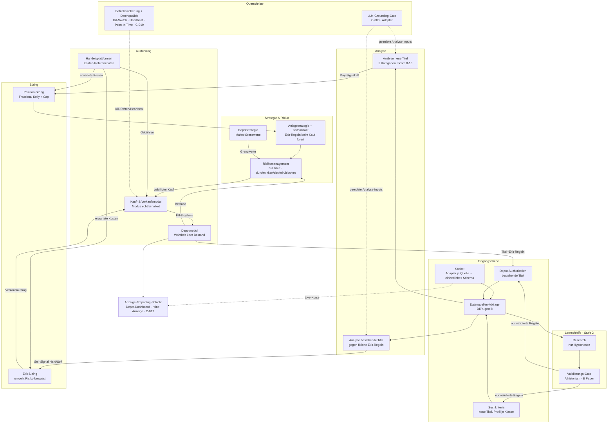

# Detailkonzept / Architektur — ki-investment

> **Schicht 2 von 3** (Konzept → Detailkonzept → Spezifikation). Das **WIE konzeptionell** — Komponenten, Layer, Boundaries, Flows, Tech-Entscheidungen. **Bindend für den `coder`**; Architektur-Konformität ist Review-Kriterium (prüfbar formuliert). Source of Truth für das WARUM/WAS bleibt `docs/concept.md` (C-001..C-020) — diese Datei verletzt sie nicht, sie konkretisiert sie.
>
> Stack fixiert (`.claude/profile.md`): Python 3.13 · FastAPI · uv · Postgres (alembic) · Redis · Docker/ghcr. Der Stack wird hier **nicht neu verhandelt**, nur ausgestaltet.

## 1. Überblick

Das System ist ein **modularer Monolith** (C-020, C-004) — eine einzelne FastAPI-Anwendung, in der **16 Kernmodule** entlang des Datenflusses als lose gekoppelte Pakete mit expliziten Input/Output-Verträgen liegen, ergänzt um eine reine **Anzeige-/Reporting-Schicht** (C-017) und zwei **Querschnitte** (LLM-Grounding C-008, Betriebssicherung/Datenqualität C-019). Microservices sind bewusst ausgeschlossen (C-004); die Modulgrenzen sind so scharf gezogen, dass eine spätere Extraktion möglich bliebe, ohne sie zum Start zu bezahlen (architecture/R05).

Die tragende Idee: der **Order-Pfad ist ein deterministischer Kern ohne I/O und ohne LLM** (Signal → Sizing → Risiko-Gate → Order). Externe Welt (Datenquellen, Broker, LLM, DB, Redis) sitzt ausschließlich in **Adaptern** hinter Ports (Hexagonal / Ports & Adapters). Das macht jede Order-relevante Regel unit-testbar ohne Netzwerk und erzwingt architektonisch, dass ein LLM nie eine Order auslösen kann (BR-001).

Zentrale Doktrin aus dem Konzept, die die Architektur trägt:
- **«Das LLM darf denken, aber nicht behaupten und nicht handeln.»** (C-008)
- **«Jede Zahl stammt aus einer API, jede Entscheidung trifft ein deterministisches Modul.»** (C-003)
- **«Ein Toggle darf niemals dazu führen, dass eine gehaltene Position blind wird.»** (C-006)
- **Modus-Schalter echt/simuliert statt separatem Backtesting** (C-016); MVP ausschließlich Paper.

## 2. Architektur-Prinzipien (bindend)

- **P1 — Dependency-Richtung nach innen** (architecture/R01): `api`/`orchestration` → `domain` ← `adapters`. Der `domain`-Kern importiert **nichts** aus `adapters`, `api`, `db`, `llm`, `scheduler`. Verletzung = Important-Review-Finding.
- **P2 — Explizite Modul-Verträge** (architecture/R02): Jeder Modul-Übergang läuft über ein typisiertes DTO (Pydantic-Modell in `app/contracts/`), nie über gemeinsam mutierten Zustand. Kein Modul greift in die interne Struktur eines anderen.
- **P3 — Deterministischer Order-Pfad**: Alles zwischen Buy-Signal und Order-Platzierung (Sizing, Risiko-Gate, Strategie/Exit-Regeln) ist reine Funktion ihrer Inputs — kein LLM-Call, kein Netzwerk-I/O, keine Systemzeit-Abhängigkeit außer explizit übergebenem `as_of`-Timestamp (Point-in-Time).
- **P4 — DRY-Datenzugang** (C-009, C-020): Genau **ein** Modul `datasource_query` bündelt den Datenquellen-Zugriff für seine drei Konsumenten (Suchkriteria, Depot-Suchkriterien, Research). Kein Konsument spricht einen Socket-Adapter direkt an.
- **P5 — Live-Kurs als Cross-Cutting-Service**: Der Zugriff auf Live-Kurse ist ein geteilter Service des Sockets (C-017); die Anzeige-Schicht baut **keine** eigene Preisanbindung.
- **P6 — Anlageklassen sind Konfiguration, keine Code-Grenze** (C-006): Es gibt keine klassenspezifischen Codepfade als `if asset_class == …`-Ketten im Kern; Klassenverhalten kommt aus Konfigurationsdaten (Methodentabellen, Gewichte, Toggles, Profile).
- **P7 — Geld ist `Decimal`, nie `float`**: Alle Beträge, Preise, Mengen, G/V in `decimal.Decimal`; Rundung explizit an definierten Stellen. Scores/Statistik dürfen `float`/`numpy` nutzen, Geldwerte nie.
- **P8 — Idempotenz & At-Least-Once** (architecture/R06): Order-Ausführung und Depot-Fortschreibung sind über idempotente Operationen entkoppelt (Client-Order-ID als Dedup-Schlüssel); Redis-Queue liefert at-least-once, Konsumenten sind idempotent.

## 3. Modulkarte

Die 16 Kernmodule (C-020) plus Anzeige-Schicht plus Querschnitte. Durchgezogen = Hauptdatenfluss; Anlageklassen sind globale Wertedomäne (kein Flussschritt).



**Modul-Kurzverträge** (Input → Output; Detail in den jeweiligen Specs):

| # | Modul | Layer | Input | Output |
|---|---|---|---|---|
| 1 | Socket | adapter | externe Quellen (SEC, Reddit, FRED, Polymarket, Broker-Feed) | normalisierte Roh-Records (Quelle, Timestamp, Klassen-Tag 1–11, Qualitätsindikator) → Bronze |
| 2 | Datenquellen-Abfrage | orchestration | Bronze/Silver + Suchkriterien | einheitliches Signal-Bündel je Titel (inkl. Liquidität, Volatilität) |
| 3 | Suchkriteria | domain | Suchprofile je Klasse + Gate-Updates | Filterkriterien an (2) |
| 4 | Depot-Suchkriterien | domain | Titel+Strategie+Exit-Regeln aus (16) | Beobachtungs-Filter an (2) |
| 5 | Research | domain+llm | Signal-Bündel Tagesgewinner | Hypothesen an (6) — **nie** direkte Regeln |
| 6 | Validierungs-Gate | domain | Hypothese + Historie/Paper-Metriken | Ampel 🟢/🟡/🔴 + validierte Regel an (3)/(4) |
| 7 | Analyse neue Titel | domain (LLM als Input) | Signal-Bündel Kandidat | Gesamtscore 0–10 + Buy-Signal (≥8) an (9) |
| 8 | Analyse bestehende Titel | domain (LLM als Input) | Position + fixierte Exit-Regeln + Signal-Bündel | Sell-Signal mit Dringlichkeit Hard/Soft an (10) |
| 9 | Position-Sizing | domain | Buy-Signal + erwartete Kosten | Ordergröße an (11) |
| 10 | Exit-Sizing | domain | Sell-Signal + Dringlichkeit + Liquidität + Kosten | Verkaufsauftrag direkt an (14) |
| 11 | Anlagestrategie+Zeithorizont | domain | Ordergröße + Titelkontext | Positionsattribute (Strategie, Horizont, Exit-Regeln, These) an (13) |
| 12 | Depotstrategie | domain | Nutzerkonfig (Grenzwerte) | Makro-Grenzwerte an (13) |
| 13 | Risikomanagement | domain | geplanter Kauf + Grenzwerte + Depotstand | durchwinken / deckeln / blockieren an (14) |
| 14 | Kauf-&-Verkaufsmodul | orchestration+adapter | gebilligter Kauf / Verkaufsauftrag + Kosten | Order via Broker-Port → Fill-Ergebnis an (16) |
| 15 | Handelsplattformen | config/domain | Klassen-Stammdaten | erwartete Kosten an (9)/(10), Gebühren an (14) |
| 16 | Depotmodul | domain+db | Fills | Bestand, realisierter/unrealisierter G/V, Transaktionshistorie |

## 4. Layer & Verzeichnisstruktur

Vier Layer, Abhängigkeiten strikt nach innen (P1). Der `domain`-Kern ist der stabile Mittelpunkt.

```
app/
  main.py                 # FastAPI-App-Factory + Lifespan (Scheduler, Redis, DB-Pool starten/stoppen)
  config.py               # Settings via pydantic-settings; lädt Feature-Toggles + Modus-Schalter
  contracts/              # Pydantic-DTOs = die Modul-Verträge (P2). Von allen Layern importierbar.
  domain/                 # REINER KERN — keine I/O, kein LLM, kein FastAPI, kein SQLAlchemy (P1/P3)
    assetclasses/         #   11 Klassen als Wertedomäne + Toggle-Auswertung (P6)
    scoring/              #   Analyse-Framework: Kategorie-Score, Gesamtscore, Sanity-Cap, Schwellen (C-007)
    analysis_new/         #   Modul 7 — Buy-Bewertung
    analysis_existing/    #   Modul 8 — Wiederbewertung gegen fixierte Exit-Regeln
    search_criteria/      #   Modul 3
    portfolio_search/     #   Modul 4 (Depot-Suchkriterien)
    research/             #   Modul 5 (Hypothesen-Logik, LLM-Input kommt als DTO)
    validation_gate/      #   Modul 6 (PSR/MinTRL/DSR/Walk-Forward, Ampel)
    sizing/               #   Modul 9 + 10 (Position-Sizing, Exit-Sizing)
    strategy/             #   Modul 11 (Strategie, Zeithorizont, Exit-Regel-Fixierung beim Kauf)
    portfolio_policy/     #   Modul 12 (Depotstrategie, Presets)
    risk/                 #   Modul 13 (Drei-Wege-Entscheid, Korrelation, Kelly-Cap)
    portfolio/            #   Modul 16 (Bestandslogik, G/V, FX-Attribution) — DB via Repository-Port
    trading_platforms/    #   Modul 15 (Kosten-Referenzdaten-Logik)
    quant/                #   Eigenbau TA + Risk & Quantitativ (numpy/scipy/pandas-ta) — C-018
  orchestration/          # APPLICATION-Layer: verdrahtet Module zu Flows, hält keine Geschäftsregeln
    ingest_pipeline.py    #   Socket → Bronze/Silver/Gold; Modul 2 (Datenquellen-Abfrage)
    buy_pipeline.py       #   Flow §5.1
    sell_pipeline.py      #   Flow §5.2
    execution_service.py  #   Modul 14 Orchestrierung (Modus-Schalter, Fehlerbehandlung, TCA)
    learning_loop.py      #   Research → Gate (Stufe 2)
  adapters/               # ADAPTER-Layer: implementiert Ports aus domain/*, spricht die Außenwelt
    sockets/              #   ein Adapter je Datenquelle (Modul 1) → einheitliches Schema
    brokers/              #   Broker-Port: paper/live/sim (IBKR-Paper MVP; sim für brokerlose Krypto)
    llm/                  #   LLM-Adapter HINTER dem Grounding-Gate (C-008) — nie im Order-Pfad
    marketdata/           #   Live-Kurs-Service (Cross-Cutting, P5)
    repositories/         #   SQLAlchemy-Implementierungen der domain-Repository-Ports
  db/                     # SQLAlchemy-Modelle + alembic-Migrationen (Modell kommt aus data-model.md/dba)
  data/                   # Bronze/Silver/Gold-Repos, Point-in-Time-Zugriff (C-009, C-019)
  scheduler/              # Scheduler + Redis-Queue-Worker (Token-Bucket je Quelle, Backoff, DLQ)
  core/                   # QUERSCHNITT: kill_switch, heartbeat, drawdown_monitor, secrets, logging, errors
  api/                    # HTTP-Layer (FastAPI-Router): Anzeige/Reporting (C-017) + Control-Plane
    dashboard.py          #   reine Anzeige (Depot, Live-Kurse, Spinnennetz) — verändert nie Trading-Logik
    control.py            #   Kill-Switch, Modus-Schalter, Toggles, Health
tests/                    # pytest (uv run pytest); Domain-Kern ohne Netzwerk testbar
```

**Boundary-Regeln (prüfbar):**
- `app/domain/**` darf **nicht** importieren: `fastapi`, `sqlalchemy`, `redis`, `app.adapters.*`, `app.api.*`, `app.db.*`, `app.scheduler.*`. (Import-Linter/Grep-prüfbar.)
- Zugriff des Kerns auf DB/Broker/LLM ausschließlich über **Ports** (abstrakte Protokolle in `app/domain/**/ports.py`), implementiert in `app/adapters/**`.
- `app/api/dashboard.py` ruft **keine** Order-, Sizing- oder Risiko-Funktion auf (nur Lese-Queries) — Anzeige verändert keine Trading-Logik (C-017).

## 5. Kern-Datenflüsse

### 5.1 Ingest (Scheduler-getrieben)
1. Scheduler plant je Quelle nach Frequenz (Polymarket/Whale 30–60 s · Reddit 15–30 min · SEC 2 h · FRED täglich, C-009), respektiert Anlageklassen-Toggle (BR-017) und Token-Bucket.
2. Socket-Adapter holt Rohdaten → normalisiert in einheitliches Schema (Quelle, Timestamp, Klassen-Tag, Qualitätsindikator) → **Bronze** (roh, unverändert, Point-in-Time).
3. Validierung + Corporate-Actions-Adjustierung + Dedup → **Silver**; abgeleitete Signale/Features (z-Scores, Sentiment-Decay) → **Gold** (BR-023). Revisionsbehaftete Quellen (FRED) mit Recalculation-Window 2–3 Tage.
4. Fehler → Exponential Backoff → nach n Versuchen Dead-Letter-Queue.

### 5.2 Buy-Pfad (deterministisch ab Signal)
1. `datasource_query` liefert Signal-Bündel je Kandidat (nur aktive Klassen, BR-017).
2. **Analyse neue Titel**: LLM liefert **geerdete** Kategorie-Fakten als DTO (durch das Grounding-Gate: Schema-Validierung BR-003, Cross-Check BR-004); `scoring` berechnet deterministisch Kategorie-Scores und Gesamtscore (C-007-Formeln). No-Evidence-No-Trade bei fehlender Kategorie (BR-005). **Sanity-Cap** (BR-008) und Signal-Schwellen (BR-007) greifen deterministisch.
3. Bei Gesamtscore ≥ 8 → Buy-Signal (BR-009) → **Position-Sizing** (Fractional Kelly + hartes Cap; Pre-Trade-Kosten reduzieren/verwerfen, BR-015/BR-016).
4. **Anlagestrategie+Zeithorizont** fixiert Strategie, Horizont, Exit-Regeln (Stop-Loss, Take-Profit, Thesis-Invalidierung, optional Time-Box) und die These **beim Kauf** (BR-010).
5. **Risikomanagement** (nur Kauf) entscheidet gegen Depotstrategie-Grenzwerte + Depotstand: durchwinken / deckeln (ohne Rück-Durchlauf) / blockieren (BR-014).
6. **Kauf-&-Verkaufsmodul** platziert Order über den Broker-Port im aktiven Modus (BR-019), behandelt Teilfills/Rejects/Timeouts, misst Arrival-Price-Slippage → Fill an Depotmodul (idempotent via Client-Order-ID, P8).

### 5.3 Sell-Pfad (umgeht Risikomanagement)
1. **Depot-Suchkriterien** speisen `datasource_query` mit Beobachtungsfiltern je gehaltener Position (auch bei deaktivierter Klasse, BR-018).
2. **Analyse bestehende Titel** prüft **nur gegen die beim Kauf fixierten Exit-Regeln** (BR-011) → Sell-Signal mit Dringlichkeit **Hard** (These gebrochen: Hack/Betrug/Delisting/Insolvenz → sofort) oder **Soft** (Verschlechterung → gestaffelt).
3. **Exit-Sizing** (Hard → Market/Stop-Market sofort; Soft → gestaffelt, Limit-Default) → **direkt** an das Kauf-&-Verkaufsmodul (BR-012, BR-013 — **kein** Risiko-Gate).

### 5.4 Lernschleife (Stufe 2)
Research liefert nur Hypothesen (BR-024) → Validierungs-Gate (A historisch mit Trial-Registry, B Paper-Bewährung PSR/MinTRL) → Ampel; nur 🟢 promotet eine Regel in Suchkriteria/Depot-Suchkriterien, 🟡 nur Paper-Modus, 🔴 archiviert (BR-025).

## 6. Zustände

- **Position-Lifecycle**: `KANDIDAT → GEKAUFT(aktiv) → IN_WIEDERBEWERTUNG → EXIT_ANGESTOSSEN(Hard|Soft) → TEIL-/GESCHLOSSEN`. Bei Klassen-Deaktivierung bleibt eine aktive Position im Überwachungs-/Exit-Zustand (BR-018).
- **Order-Lifecycle**: `NEU → PLATZIERT → (TEILFILL)* → GEFÜLLT | REJECT | TIMEOUT | STORNIERT`; jeder Übergang idempotent, Reject/Timeout ist Kernfall (nicht Ausnahme), C-016.
- **Betriebszustand (Kill-Switch, BR-021)**: `NORMAL → HALT_ANGEFORDERT → FLATTEN (offene Orders stornieren, Positionen glattstellen soweit Modus erlaubt) → HALTED (keine neuen Käufe; nur manueller Reset)`. Heartbeat-Ausfall oder Drawdown-Schwelle triggert Alert bzw. HALT (BR-022).
- **LLM-Kette (BR-006)**: `AKTIV → (Halluzinations-KPI > 2 %) → DEAKTIVIERT (LLM aus Entscheidungskette, Analyse fällt auf No-Evidence-No-Trade zurück) → manueller Reset`.

## 7. Externe Schnittstellen

| Schnittstelle | Rolle | Vertragspunkt | Layer |
|---|---|---|---|
| IBKR (Paper) | Broker MVP | Order platzieren/stornieren, Fills, Kontostand; gleiche API Paper/Live | `adapters/brokers` |
| Krypto-Sim (brokerlos) | Paper-Krypto MVP | virtuelle Fills mit Slippage-Modell (BR-020) | `adapters/brokers` |
| SEC Form 4 · Reddit · FRED · Polymarket · Wirtschaftskalender | Freiquellen MVP | ein Socket-Adapter je Quelle, normalisiertes Schema | `adapters/sockets` |
| LLM (Analyse-Assistent) | geerdete Analyse | **nur** hinter Grounding-Gate; JSON-Schema-Output; nie Order (BR-001) | `adapters/llm` |
| Postgres | Bronze/Silver/Gold + Depot + Historie | Repository-Ports; Point-in-Time-Lesungen | `db` / `data` |
| Redis | Scheduler-Queue + Cache | Token-Bucket, DLQ, at-least-once (P8) | `scheduler` |

Broker-/Krypto-Anbindung (IBKR vs. Kraken) und die genaue API-Handelbarkeit je Klasse klärt die Spec-Phase (C-016) — der **Broker-Port** abstrahiert das, sodass die Wahl den Kern nicht berührt.

## 8. Technologie-Entscheidungen (ADR)

Format kurz (Kontext → Entscheidung → Konsequenz/verworfene Alternative), MADR-nah (architecture/R07).

- **ADR-001 — Modularer Monolith, Ports & Adapters.** Kontext: 16 Module, ein Owner, Betrieb muss einfach bleiben. Entscheidung: ein FastAPI-Deployable, Module als Pakete mit DTO-Verträgen, Außenwelt hinter Ports. Alternative Microservices verworfen (C-004, architecture/R05 — Servicegrenzen erst bei nachgewiesenem Bedarf). Konsequenz: eine Codebasis/DB, spätere Extraktion offen gehalten.
- **ADR-002 — Deterministischer Domain-Kern ohne I/O.** Entscheidung: der Order-Pfad ist reine Funktion; DB/Broker/LLM nur über Ports. Konsequenz: Order-Regeln (BR-007..BR-016) sind ohne Netzwerk unit-testbar; erzwingt BR-001 strukturell.
- **ADR-003 — LLM als isolierter Adapter hinter Grounding-Gate.** Kontext: Halluzinationsrisiko propagiert sonst in Orders (C-008). Entscheidung: LLM in `adapters/llm`, Output nur als schema-validiertes, cross-gechecktes DTO in `analysis_*`. Konsequenz: LLM kann per Design keine Order auslösen; abschaltbar (BR-006) ohne Kernänderung.
- **ADR-004 — FastAPI async + `asyncio.TaskGroup` für parallele Socket-Abrufe.** Entscheidung: I/O-lastige Ingest-Arbeit async; strukturierte Nebenläufigkeit (python/R05) statt loser `gather`. Konsequenz: ein Socket-Fehler cancelt Geschwister sauber; Domain-Rechenlogik bleibt synchron/pur.
- **ADR-005 — Postgres als Bronze/Silver/Gold-Store mit Point-in-Time.** Entscheidung: Roh-→veredelt-→abgeleitet in schema-getrennten Tabellen; historische Lesungen per `as_of`. Konsequenz: Survivorship-Bias-Vermeidung + Replay (BR-023). Detail-Datenmodell → `dba`/`data-model.md`.
- **ADR-006 — Redis als Scheduler-Queue + Cache.** Entscheidung: Queue-of-Work mit Token-Bucket je Quelle, Exponential Backoff, Dead-Letter-Queue (C-009). Konsequenz: unterschiedliche Frequenzen entkoppelt; at-least-once → Konsumenten idempotent (P8, architecture/R06).
- **ADR-007 — Modus-Schalter über den Broker-Port (paper/live/sim), MVP nur Paper.** Entscheidung: derselbe Code-Pfad, nur andere Port-Implementierung/Key; global und je Klasse überschreibbar (C-016). Konsequenz: kein separates Backtesting-System (C-004); ersetzt durch Paper + Validierungs-Gate.
- **ADR-008 — Feature-Toggles + Methodentabellen/Gewichte als Konfigurationsdaten.** Entscheidung: 11 Klassen, Presets, Rankings, Kategoriegewichte, Suchprofile liegen als Konfiguration (DB/Config), nicht als Code-Zweige (P6). Konsequenz: Aktivierung/Kalibrierung ohne Code-Änderung; quartalsweise Ranking-Review datengetrieben.
- **ADR-009 — Eigenbau für Technische Analyse + Risiko/Quantitativ.** Kontext: 0×AUTO / viele BUILD (C-018). Entscheidung: `domain/quant` mit numpy/scipy/pandas-ta (Volatilität, Beta, Sharpe/Sortino, VaR, Max Drawdown, Monte Carlo). Konsequenz: keine Blackbox im Order-relevanten Rechenkern.
- **ADR-010 — Geldarithmetik in `Decimal`, Statistik in `float`.** Entscheidung: P7. Konsequenz: keine Float-Rundungsfehler in Beträgen/G/V; klare Grenze zwischen Geld (Decimal) und Score/Statistik (float/numpy).
- **ADR-011 — Fill→Depot-Fortschreibung idempotent (Client-Order-ID).** Entscheidung: at-least-once-Zustellung, Dedup über Order-ID (architecture/R06). Konsequenz: doppelte Events verfälschen den Bestand nicht (Bestand = Wahrheit, C-017).

## 9. Geschäftsregeln (BR-Katalog)

> Zentrale, feature-übergreifende **Verhaltensinvarianten**. Jede lebt hier **einmal**; Specs referenzieren via `(→ BR-NNN)`, Tests taggen via `#BR-NNN`. IDs sind **stabil** (nicht umnummerieren). Namensraum ist **fortlaufend über `architecture.md` und `data-model.md`**: die hier vergebenen Verhaltensregeln enden bei **BR-025**; **datenvalidierende** Regeln in `data-model.md` beginnen bei **BR-026**. `BR-NNN` (Projekt-Geschäftsregel) ≠ `python/R<NN>` / `architecture/R<NN>` (Fabrik-Qualitätsregel).

### BR-001: LLM nie im Order-Pfad
Buy-Signal-Berechnung, Position-/Exit-Sizing, Risiko-Gate und Order-Ausführung sind **ausschließlich deterministische Module** ohne LLM-Aufruf. Ein LLM-Ergebnis darf nie direkt eine Order auslösen. (C-008 · harte Architektur-Regel · prüfbar: kein Import aus `adapters/llm` in `domain/sizing`, `domain/risk`, `orchestration/*_pipeline`, `execution_service`.)

### BR-002: Grounding-Pflicht
Jede Zahl in einer Analyse stammt aus einer Datenquelle und trägt **Quellen-ID + Timestamp**; das LLM erzeugt keine Kennzahlen selbst. Kennzahlen ohne Herkunft werden nicht verarbeitet. (C-008.1)

### BR-003: Strukturierter, schema-validierter LLM-Output
LLM-Analysen werden als JSON nach festem Schema angenommen (Kategorie-Score 0–10, Fakten mit Quellen-IDs, Begründung). Schema-Verletzung → Analyse verworfen (erster Halluzinationsfilter). (C-008.2)

### BR-004: Deterministischer Zahlen-Cross-Check
Jede vom LLM referenzierte Zahl wird gegen die Originalquelle geprüft; Abweichung über die kennzahltyp-spezifische Toleranz → Analyse **verworfen und geloggt**. (C-008.3)

### BR-005: No-Evidence-No-Trade
Fehlt die Datengrundlage einer ganzen Analysekategorie, wird der Titel **übersprungen** — die Lücke wird nie durch eine LLM-Schätzung ersetzt. (C-008.4)

### BR-006: Halluzinations-KPI-Kill
Übersteigt die aus dem Cross-Check gemessene Faktenabweichung **2 %**, wird das LLM aus der Entscheidungskette genommen (Alarm); die Analyse fällt auf No-Evidence-No-Trade zurück, bis manuell reaktiviert. (C-008 Monitoring)

### BR-007: Score→Signal-Schwellen
Aus dem Gesamtscore (0–10) folgt das Signal deterministisch: ≥ 8 KAUF · 6–7.9 BEOBACHTEN · 4–5.9 HALTEN · 2–3.9 REDUZIEREN · < 2 VERKAUF. (C-007)

### BR-008: Sanity-Cap
Ist der Risiko-Score einer Bewertung **< 3**, wird das Gesamtsignal auf **maximal «Halten»** gedeckelt — unabhängig vom rechnerischen Gesamtscore. (C-007)

### BR-009: Buy nur bei Gesamtscore ≥ 8
Ein Buy-Signal (Weiterleitung an Position-Sizing) entsteht ausschließlich bei Gesamtscore ≥ 8 nach Anwendung des Sanity-Caps (BR-008). (C-007, C-011)

### BR-010: Exit-Regeln beim Kauf fixiert
Beim Kauf werden je Titel Strategie, Zeithorizont, Exit-Regeln (Stop-Loss, Take-Profit, Thesis-Invalidierung, optional Time-Box) und die These fixiert; sie begleiten die Position bis zum Verkauf und werden **nie beim Verkauf neu verhandelt**. (C-014 · Disposition-Effekt, Odean 1998)

### BR-011: Wiederbewertung nur gegen fixierte Exit-Regeln
Die Analyse bestehender Titel prüft ausschließlich gegen die beim Kauf fixierten Exit-Regeln (BR-010) — kein «moving the goalposts». Leitfrage: «Würden wir heute kaufen, wenn wir nicht hielten?» (C-011)

### BR-012: Sell-Dringlichkeit steuert Exit-Sizing
Sell-Signale tragen eine Dringlichkeit: **Hard** (These fundamental gebrochen → sofort alles, Market/Stop-Market) oder **Soft** (Verschlechterung → gestaffelt, Limit-Default). Die Dringlichkeit ist das wichtigste Exit-Sizing-Kriterium. (C-011, C-013)

### BR-013: Verkäufe umgehen das Risikomanagement
Verkaufsaufträge gehen vom Exit-Sizing **direkt** ans Kauf-&-Verkaufsmodul und durchlaufen **nicht** das Risikomanagement (ein Verkauf reduziert Risiko; verhindert den Disposition-Effekt). (C-015, C-016)

### BR-014: Risikomanagement nur beim Kauf, Drei-Wege-Entscheid
Das Risikomanagement greift **nur bei Käufen** und trifft genau einen von drei Entscheiden: **durchwinken / runtersizen (einfache Deckelung, kein erneuter Durchlauf) / blockieren** — geprüft gegen Klumpenrisiko, Stress-Korrelation, Drawdown-Limits und portfolio-weiten Kelly-Cap. (C-015)

### BR-015: Pre-Trade-Kosten reduzieren oder verwerfen den Trade
Erwartete Kosten (Courtage + Spread + geschätzte Slippage) aus den Handelsplattform-Referenzdaten fließen ins Position-/Exit-Sizing und können einen Trade verkleinern oder ganz verwerfen. (C-013, C-016)

### BR-016: Positions-Cap und Kelly-Scharfschaltung
Zusätzlich zur Fractional-Kelly-Größe gilt ein hartes Positions-Cap (1–2 % Risiko je Trade); Kelly wird erst scharf geschaltet, wenn ≥ 50–100 Trades im Simulationsmodus gesammelt sind — vorher konservative Fixed-Fractional-Regel. (C-013)

### BR-017: Toggle inaktiv = keine Verarbeitung, keine Kosten
Eine deaktivierte Anlageklasse erzeugt **keinerlei** Verarbeitung und **keine** Datenkosten (Suchkriteria, Datenquellen-Abfrage, Analyse, Ausführung, Depotstrategie respektieren den Toggle). (C-006)

### BR-018: Deaktivierung lässt gehaltene Positionen nicht erblinden
Wird eine Klasse mit offenen Positionen deaktiviert, entstehen **keine neuen Käufe**, aber **Überwachung und Exits bleiben aktiv** — ein Toggle darf nie dazu führen, dass eine gehaltene Position blind wird. (C-006)

### BR-019: Modus-Schalter echt/simuliert, MVP nur Paper
Kauf/Verkauf laufen über denselben Code-Pfad im Modus «echt» oder «simuliert» (nur andere Broker-Port-Implementierung/Key), global und je Klasse überschreibbar. Im MVP ist ausschließlich Paper aktiv; Live ist gesperrt. (C-005, C-016)

### BR-020: Simulations-Realismus
Auf simulierte (Paper-)Fills wird ein eigenes Slippage-/Spread-Modell angewandt — sofortige Fills zum letzten Kurs sind unzulässig, da sie systematisch zu optimistisch sind. Arrival-Price-Slippage wird je Trade gemessen (Post-Trade-TCA). (C-016, C-019)

### BR-021: Kill-Switch «flatten & halt»
Ein ausgelöster Kill-Switch storniert offene Orders, stellt Positionen glatt (soweit der Modus es erlaubt) und **sperrt neue Käufe** bis zum manuellen Reset. (C-003, C-019)

### BR-022: Heartbeat und Drawdown-Alerts
Ein ausbleibender Heartbeat oder das Überschreiten einer Drawdown-Schwelle löst einen Alert aus und kann den Kill-Switch (BR-021) triggern. (C-019)

### BR-023: Datenqualität Point-in-Time
Rohdaten werden Point-in-Time gehalten (kein Rückschreiben), Survivorship-Bias wird vermieden und Corporate Actions werden adjustiert, bevor ein Signal daraus abgeleitet wird. (C-019)

### BR-024: Research liefert nur Hypothesen
Das Research-Modul erzeugt ausschließlich Hypothesen und **nie** direkte Regeländerungen; jede Regeländerung muss durch das Validierungs-Gate. (C-012)

### BR-025: Regel-Promotion nur über das Gate
Eine Regel wird nur in Suchkriteria/Depot-Suchkriterien übernommen, wenn das Validierungs-Gate 🟢 (beide Stufen bestanden) liefert; bei 🟡 (A bestanden, B läuft) gilt sie nur im Paper-Modus, bei 🔴 wird sie mit Begründung archiviert (nie gelöscht). (C-012)

## 10. NFRs (prüfbar, soweit relevant)

- **Betriebssicherheit ab MVP**: Kill-Switch, Heartbeat, Drawdown-Alerts vorhanden und getestet (BR-021/BR-022); Secrets nur aus Env/Vault, nie im Code/Commit (python/R09).
- **Getrennte Paper-/Live-Zugänge**: separate Broker-Keys/Endpunkte; Live im MVP hart gesperrt (BR-019).
- **Determinismus/Testbarkeit**: Order-Pfad-Module ohne Netzwerk unit-testbar (ADR-002); Zieldeckung der BR-007..BR-016 durch getaggte Tests.
- **Latenz-Toleranz**: kein HFT (C-004); Ingest-Frequenzen laut C-009, keine Sub-Sekunden-Anforderung im Order-Pfad.
- **Beobachtbarkeit**: Halluzinations-KPI, Slippage/TCA je Trade, Gate-Ampel und Betriebszustand sind abfragbar (`api/control`, Dashboard).
- **Health**: `GET /health` (Port 8080) für Smoke/Container-Readiness.

## 11. Nicht-Ziele (Architektur-Grenzen)

- **Kein Microservice-Split** zum Start (C-004, ADR-001).
- **Kein separates Backtesting-System** — ersetzt durch Modus-Schalter + Validierungs-Gate (C-004, ADR-007).
- **Kein Live-Trading im MVP** (BR-019).
- **Kein DB-Detailmodell hier** — Entitäten/Constraints/Indizes → `docs/data-model.md` (`dba`). Diese Datei nennt nur Repository-Ports und Datenschichten.
- **Kein Visual-Design** — Dashboard-Gestaltung → `designer`; hier nur die Anzeige-Schicht als Boundary (reine Lese-Schicht, C-017).
- **Rebalancing, CH-Steuerreport, Bestätigungspflicht-Modus, LSEG, ML-Infrastruktur** — geparkt/Stufe 2+ (C-004, C-012, C-018).

## 12. Offene technische Punkte

- **Broker-/Krypto-Anbindung** (IBKR vs. Kraken; welche Klassen wirklich API-handelbar) — Broker-Port abstrahiert, Wahl in der Spec-Phase (C-016).
- **JSON-Schema-Detail + Toleranzschwellen je Kennzahltyp** für BR-003/BR-004 (C-008).
- **Fill-/Slippage-Modell der Simulation** (Parameter je Klasse) für BR-020 (C-016).
- **Korrelations-Messung** (Quelle, Zeitfenster, Stress-Korrelation) und portfolio-weiter Kelly-Cap-Wert für BR-014 (C-015).
- **Score→Win-Wahrscheinlichkeit-Mapping** für Kelly (C-013).
- **Einheitliches Titel-Datenschema** und Caching-Strategie im `datasource_query` (C-009).
- **Point-in-Time-Historie für nachrichtengetriebene Signale** (Gate-Stufe A) (C-012).
- **Drawdown-Kill-Switch-Schwelle** (BR-022) — konkreter Wert offen (C-015).
- **Import-Boundary-Enforcement**: Tool-Wahl (z. B. import-linter) zur automatischen Prüfung von P1/BR-001 im CI — in der Spec-/Setup-Phase festzulegen.
