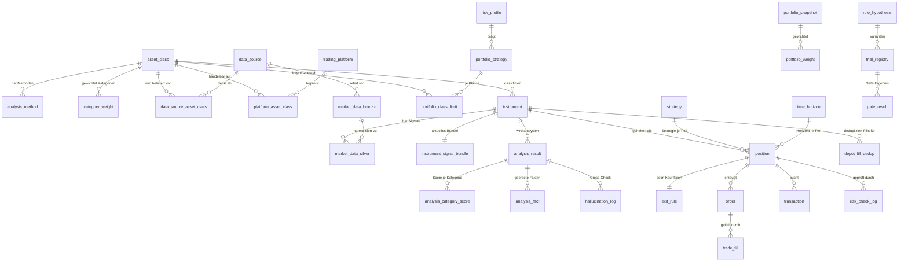

db_dialect: postgres

# Datenmodell — ki-investment

> **Teil des Detailkonzepts (DB-Domäne).** Geschrieben vom `dba`, bindend für den `coder`. Der `coder` setzt es 1:1 in **alembic**-Migrationen um (Dialekt: PostgreSQL 17) — hier **kein SQL**, nur das Modell (Entitäten, Typen, Constraints, Indizes, Partitionierung, Retention).
>
> Quelle: `docs/concept.md` (C-001…C-020) + Original-Notizen (Depotmodul, Validierungs-Gate, Datenquellen, Datenquellen-Abfrage, Socket, LLM-Grounding, Anlageklassen, Handelsplattformen, Strategie/Zeithorizont). Typen sind **sprachneutral** beschrieben; die PostgreSQL-Idiome (Enum vs. CHECK, `TIMESTAMPTZ`, `NUMERIC`, `JSONB`, deklarative Partitionierung) wählt der `coder` beim Umsetzen.
>
> **BR-Namensraum:** Datenvalidierende Regeln dieses Modells starten bei **BR-100** (fortlaufend), um Kollisionen mit dem verhaltensbezogenen `architecture.md`-Katalog (BR-001…) zu vermeiden. Specs referenzieren via `(→ BR-NNN)`, Tests taggen `#BR-NNN`.
>
> **Mode-Isolation (Querschnitt):** Nahezu alle transaktionalen Entitäten tragen `mode ∈ {echt, simuliert}` (C-016 Modus-Schalter). `echt`- und `simuliert`-Daten werden in Aggregaten **nie** vermischt (→ BR-130). Der Paper-Modus ist MVP-Default (C-005).

---

## Konventionen

- **Primärschlüssel:** synthetische `UUID` (PG17: `gen_random_uuid()`; bei PG18-Upgrade `uuidv7()` für Index-Lokalität, `sql/R09`) — außer **fachlich fixe Referenz-IDs** (Anlageklasse 1–11, siehe `asset_class`).
- **Zeit:** alle Zeitstempel `TIMESTAMPTZ` (UTC), Basiswährung **CHF** (C-002).
- **Geld/Kurse:** `NUMERIC(20,8)` (exakt, nie Float) — deckt Krypto-Nachkommastellen.
- **Prozente/Scores:** `NUMERIC(6,3)`; Scores 0–10, Gewichte 0–100.
- **Enums:** als PostgreSQL-`ENUM`-Typ **oder** `TEXT + CHECK` — der `coder` entscheidet; das Modell nennt die zulässige Wertemenge.
- **Audit:** `created_at TIMESTAMPTZ NOT NULL DEFAULT now()` auf allen Tabellen; `updated_at` nur auf mutierbaren.
- **Secrets:** API-Keys/OAuth-Tokens werden **nie** in DB-Spalten gespeichert (→ BR-126); nur ein `vault_ref` (Zeiger auf Secrets-Manager).
- **Kein Mandanten-Kontext / kein RLS:** Single-Owner-System (C-002, ein Nutzer = der Owner). RLS ist bewusst **nicht** Teil dieses Modells; wird Multi-User später eingeführt, ist RLS pro Tabelle nachzurüsten (Enforcement-Spalte `owner_id` + Policy) — als expliziter ADR-Punkt für die Spec-Phase vermerkt.

---

## ER-Überblick (Mermaid)

---

## 1 · Konfigurations- & Stammdaten

### `asset_class` — Anlageklasse (C-006, verbindliche Nummerierung 1–11)
| Feld | Typ | Constraint |
|---|---|---|
| id | SMALLINT | PK, **fix 1–11** (CHECK `id BETWEEN 1 AND 11`), keine synthetische UUID |
| name | TEXT | NOT NULL, UNIQUE |
| prio_stufe | TEXT | NOT NULL, CHECK ∈ {MVP, Stufe2, Stufe3} |
| aktiv | BOOLEAN | NOT NULL, DEFAULT (id ∈ {1,2,7} → true sonst false; C-005 MVP-Default Aktien+ETFs+Krypto) |
| retail_driven | BOOLEAN | NOT NULL, DEFAULT false (nur 1 Aktien, 7 Krypto → true; steuert Reddit-Sentiment, → BR-123) |

### `analysis_category` — 5 Analysekategorien (C-007)
| Feld | Typ | Constraint |
|---|---|---|
| code | TEXT | PK, CHECK ∈ {fundamental, technisch, qualitativ, makro, risiko_quant} |
| name | TEXT | NOT NULL |
| ist_risiko | BOOLEAN | NOT NULL, DEFAULT false (nur `risiko_quant` → true; Basis für Sanity-Cap BR-106) |

### `category_weight` — Kategoriegewicht je Anlageklasse (C-006, C-007)
| Feld | Typ | Constraint |
|---|---|---|
| asset_class_id | SMALLINT | FK → asset_class.id |
| category_code | TEXT | FK → analysis_category.code |
| weight_pct | NUMERIC(6,3) | NOT NULL, CHECK `0 ≤ weight_pct ≤ 100` |
| config_version | SMALLINT | NOT NULL, DEFAULT 1 — reine Tag-Spalte, **NICHT** Teil des PK und **NICHT** ausreichend für AC10 ("nachvollziehbar, welche Konfigurationsversion einer Analyse zugrunde lag"): ein künftiges Hochzählen per UPDATE überschreibt die Vorgänger-Gewichte in derselben Zeile, es entsteht **keine** Historie. Für AC10 fehlt noch — Folge-Story — entweder (a) eine separate Historien-/Snapshot-Tabelle je Version, oder (b) `config_version` als Teil eines erweiterten PK (`asset_class_id, category_code, config_version`) mit append-only-Zeilen + „aktuell gültig"-Zeiger; in beiden Fällen zusätzlich eine Referenz von `analysis_result` auf die tatsächlich genutzte Version |
| — | — | PK (asset_class_id, category_code) · Σ je Klasse = 100 (→ BR-101) |

### `analysis_method` — Methodentabelle je Klasse (C-006, C-007, C-018)
| Feld | Typ | Constraint |
|---|---|---|
| id | UUID | PK |
| asset_class_id | SMALLINT | FK → asset_class.id, NOT NULL |
| category_code | TEXT | FK → analysis_category.code, NOT NULL |
| code | TEXT | NOT NULL (z.B. F1, T1, Q1, M1, R1) |
| kurzbezeichnung | TEXT | NOT NULL |
| beschreibung | TEXT | |
| nutzen | TEXT | |
| ranking | SMALLINT | NOT NULL, CHECK `1 ≤ ranking ≤ 10` (fix je Klasse, quartalsweise Review; → BR-102) |
| automation_grade | TEXT | CHECK ∈ {AUTO, TEIL, BUILD} (C-018 Plugin-Integrationsgrad) |
| — | — | UNIQUE (asset_class_id, code) |

### `data_source` — Datenquellen-Registry (C-009, 12 Quellen in 5 Kategorien)
| Feld | Typ | Constraint |
|---|---|---|
| id | UUID | PK |
| name | TEXT | NOT NULL, UNIQUE |
| kategorie | TEXT | CHECK ∈ {equity_fundamentals, retail_social, blockchain_crypto, etf_fonds, makro_anleihen} |
| qualitaet | TEXT | CHECK ∈ {niedrig, mittel, mittel_hoch, hoch, sehr_hoch} |
| frequenz_sekunden | INTEGER | NOT NULL (Abrufintervall, Socket-Scheduling; 30–86400) |
| kostenmodell | TEXT | (frei/free_tier/pro/institutionell) |
| kosten_monatlich_chf | NUMERIC(10,2) | DEFAULT 0 |
| zugangsart | TEXT | (REST/WebSocket/OAuth) |
| rate_limit | TEXT | (z.B. „10 req/sec") |
| vault_ref | TEXT | Zeiger auf Secret (kein Klartext-Key, → BR-126) |
| aktiv | BOOLEAN | NOT NULL, DEFAULT false (MVP: nur kostenlose Quellen aktiv) |

### `data_source_asset_class` — Quelle ↔ Anlageklasse (M:N, C-009 Abdeckung)
| Feld | Typ | Constraint |
|---|---|---|
| data_source_id | UUID | FK → data_source.id |
| asset_class_id | SMALLINT | FK → asset_class.id |
| — | — | PK (data_source_id, asset_class_id) |

### `trading_platform` — Handelsplattform-Stammdaten (C-016)
| Feld | Typ | Constraint |
|---|---|---|
| id | UUID | PK |
| name | TEXT | NOT NULL, UNIQUE (z.B. Interactive Brokers, Kraken) |
| gebuehrenmodell | TEXT | (fix/gestaffelt/prozentual) |
| mindestgebuehr_chf | NUMERIC(10,2) | DEFAULT 0 |
| api_handelbar | BOOLEAN | NOT NULL, DEFAULT true (nicht jede Klasse ist API-fähig — vor Bau prüfen) |
| vault_ref | TEXT | Broker-Credentials-Zeiger (→ BR-126) |
| paper_supported | BOOLEAN | NOT NULL, DEFAULT true (Modus-Schalter simuliert, C-016) |

### `platform_asset_class` — Plattform ↔ Klasse + Kosten (M:N, C-016)
| Feld | Typ | Constraint |
|---|---|---|
| platform_id | UUID | FK → trading_platform.id |
| asset_class_id | SMALLINT | FK → asset_class.id |
| courtage_pct | NUMERIC(6,4) | Courtage je Order (bekannt) |
| typ_spread_pct | NUMERIC(6,4) | typischer Spread (halb bekannt) |
| bevorzugt | BOOLEAN | DEFAULT false (bevorzugte Plattform je Klasse) |
| — | — | PK (platform_id, asset_class_id) |

### `instrument` — Titel / handelbares Instrument (C-007, C-017)
| Feld | Typ | Constraint |
|---|---|---|
| id | UUID | PK |
| symbol | TEXT | NOT NULL |
| name | TEXT | NOT NULL |
| asset_class_id | SMALLINT | FK → asset_class.id, NOT NULL |
| gics_sector | TEXT | (GICS-Branche; Pflicht für Depotstrategie-Prüfung → BR-128) |
| gics_industry | TEXT | |
| currency | TEXT | NOT NULL, CHECK 3-stelliger ISO-Code (FX-Attribution → BR-129) |
| liquiditaet | NUMERIC(20,8) | Liquiditätskennzahl (ADV/RVOL; aus Datenquellen-Abfrage) |
| volatilitaet | NUMERIC(10,6) | annualisierte Volatilität (Exit-Sizing, ATR-Klasse) |
| — | — | UNIQUE (symbol, asset_class_id) |

### `risk_profile` — Risikoprofil (C-015, 3 Presets)
| Feld | Typ | Constraint |
|---|---|---|
| id | UUID | PK |
| name | TEXT | NOT NULL, CHECK ∈ {konservativ, ausgewogen, offensiv} |

### `portfolio_strategy` — Depotstrategie / Makro-Grenzwerte (C-015)
| Feld | Typ | Constraint |
|---|---|---|
| id | UUID | PK |
| risk_profile_id | UUID | FK → risk_profile.id, NOT NULL |
| max_einzelposition_pct | NUMERIC(6,3) | NOT NULL, CHECK 0–100 (2 % streng … 5–10 % offensiv) |
| max_sektor_pct | NUMERIC(6,3) | NOT NULL (z.B. 20 %) |
| cash_quote_ziel_pct | NUMERIC(6,3) | NOT NULL (~5 %) |
| gesamt_exposure_cap_pct | NUMERIC(6,3) | NOT NULL (portfolio-weiter Kelly-Cap 20–30 %) |
| aktiv | BOOLEAN | NOT NULL, DEFAULT false (genau eine aktive → partieller Unique-Index) |

### `portfolio_class_limit` — Klassen-Limit je Depotstrategie (C-015)
| Feld | Typ | Constraint |
|---|---|---|
| portfolio_strategy_id | UUID | FK → portfolio_strategy.id |
| asset_class_id | SMALLINT | FK → asset_class.id |
| max_klasse_pct | NUMERIC(6,3) | NOT NULL (z.B. Krypto 5–15 %) |
| — | — | PK (portfolio_strategy_id, asset_class_id) |

### `strategy` — Anlagestrategie (C-014, 18 Strategien / 4 Cluster)
| Feld | Typ | Constraint |
|---|---|---|
| id | UUID | PK |
| name | TEXT | NOT NULL, UNIQUE |
| cluster | TEXT | CHECK ∈ {passiv_regelbasiert, aktiv_fundamental, aktiv_technisch_makro, professionell_algo} |
| stufe | TEXT | CHECK ∈ {MVP, Stufe2, Stufe3, Stufe4} |

### `time_horizon` — Zeithorizont (C-014, 9 Stufen)
| Feld | Typ | Constraint |
|---|---|---|
| id | SMALLINT | PK, CHECK 1–9 (Hochfrequenz … Generationell) |
| name | TEXT | NOT NULL, UNIQUE |
| break_even_hinweis | TEXT | Transaktionskosten-Relevanz |

### `system_setting` — globale Systemeinstellungen (C-016)
| Feld | Typ | Constraint |
|---|---|---|
| key | TEXT | PK (z.B. `mode_global`) |
| value | JSONB | NOT NULL (`mode_global ∈ {echt, simuliert}`, per-Klasse-Override als Map) |
| updated_at | TIMESTAMPTZ | NOT NULL DEFAULT now() |

---

## 2 · Marktdaten-Schichtung Bronze / Silver / Gold (C-009, C-019)

### `market_data_bronze` — immutable Rohdaten, Point-in-Time, Replay (C-009, C-019)
| Feld | Typ | Constraint |
|---|---|---|
| id | UUID | Teil PK |
| data_source_id | UUID | FK → data_source.id, NOT NULL |
| source_event_id | TEXT | NOT NULL (stabile Event-ID der Quelle — Idempotenz, → BR-122) |
| asset_class_tag | SMALLINT | FK → asset_class.id (Metadaten-Tag 1–11) |
| symbol | TEXT | (falls titelbezogen) |
| payload | JSONB | NOT NULL (unveränderte Rohantwort) |
| quality_indicator | TEXT | (Socket-Qualitätsmetadatum) |
| observed_at | TIMESTAMPTZ | NOT NULL (fachlicher Zeitpunkt der Datenquelle, Point-in-Time) |
| ingested_at | TIMESTAMPTZ | NOT NULL DEFAULT now() (Aufnahmezeit — **Partitionsschlüssel**) |
| — | — | **PK (id, ingested_at)** · UNIQUE (data_source_id, source_event_id) · **append-only**, kein UPDATE/DELETE (→ BR-121) |

**Partitionierung:** deklarativ nach `RANGE (ingested_at)`, **monatliche** Partitionen (Zeitreihen, hohes Volumen). Partitionsschlüssel muss Teil von PK/Unique sein → daher `(id, ingested_at)`.

### `market_data_silver` — normalisierte Signale, einheitliches Bündel (C-009, Datenquellen-Abfrage)
| Feld | Typ | Constraint |
|---|---|---|
| id | UUID | Teil PK |
| bronze_id | UUID | Referenz auf Bronze-Ursprung (Replay-Kette) |
| instrument_id | UUID | FK → instrument.id |
| signal_type | TEXT | NOT NULL (z.B. sentiment, insider, flow, macro) |
| raw_value | NUMERIC(20,8) | |
| z_score | NUMERIC(8,4) | CHECK `-3 ≤ z_score ≤ 3` (robuster z-Score, gekappt ±3; → BR-131) |
| decay_gewicht | NUMERIC(6,4) | Aktualitäts-/Sentiment-Decay-Faktor |
| observed_at | TIMESTAMPTZ | NOT NULL (Partitionsschlüssel) |
| — | — | **PK (id, observed_at)**, RANGE-partitioniert monatlich |

### `instrument_signal_bundle` — Gold: angereichertes Signal-Bündel je Titel (C-009, Datenquellen-Abfrage)
| Feld | Typ | Constraint |
|---|---|---|
| instrument_id | UUID | PK, FK → instrument.id (1:1, aktueller Stand) |
| signals | JSONB | NOT NULL (aggregiertes Bündel je Kategorie: z-Scores, Aktualität) |
| liquiditaet | NUMERIC(20,8) | |
| volatilitaet | NUMERIC(10,6) | |
| computed_at | TIMESTAMPTZ | NOT NULL DEFAULT now() |

---

## 3 · Analyse & LLM-Grounding (C-007, C-008)

### `analysis_result` — Analyse-Ergebnis (Buy- oder Sell-Pfad, C-007, C-011)
| Feld | Typ | Constraint |
|---|---|---|
| id | UUID | PK |
| instrument_id | UUID | FK → instrument.id, NOT NULL |
| analyse_typ | TEXT | CHECK ∈ {neue_titel, bestehende_titel} (zwei getrennte Pfade C-011) |
| asset_class_id | SMALLINT | FK → asset_class.id |
| gesamtscore | NUMERIC(6,3) | CHECK `0 ≤ gesamtscore ≤ 10` (→ BR-104) |
| signal_enum | TEXT | CHECK ∈ {KAUF, BEOBACHTEN, HALTEN, REDUZIEREN, VERKAUF} (Score-Schwellen → BR-105) |
| exit_urgency | TEXT | CHECK ∈ {hard_exit, soft_exit, none} (nur Sell-Pfad, C-011) |
| sanity_cap_applied | BOOLEAN | NOT NULL DEFAULT false (Risiko-Score < 3 → max HALTEN, → BR-106) |
| schema_valid | BOOLEAN | NOT NULL (JSON-Schema-Validierung bestanden, C-008 Sicherung 2) |
| llm_model | TEXT | verwendetes Modell (Audit) |
| mode | TEXT | CHECK ∈ {echt, simuliert} |
| created_at | TIMESTAMPTZ | NOT NULL DEFAULT now() |

### `analysis_category_score` — Score je Kategorie (C-007)
| Feld | Typ | Constraint |
|---|---|---|
| analysis_result_id | UUID | FK → analysis_result.id (ON DELETE CASCADE) |
| category_code | TEXT | FK → analysis_category.code |
| score | NUMERIC(6,3) | CHECK `0 ≤ score ≤ 10` (→ BR-103) |
| evidence_present | BOOLEAN | NOT NULL (No-Evidence-No-Trade Basis, → BR-108) |
| — | — | PK (analysis_result_id, category_code) |

### `analysis_fact` — geerdete Fakten (LLM-Grounding-Vertrag, C-008 Sicherung 1+3)
| Feld | Typ | Constraint |
|---|---|---|
| id | UUID | PK |
| analysis_result_id | UUID | FK → analysis_result.id (ON DELETE CASCADE), NOT NULL |
| kennzahl | TEXT | NOT NULL |
| wert | NUMERIC(20,8) | NOT NULL |
| source_id | UUID | FK → data_source.id, **NOT NULL** (jede Zahl braucht Quelle, → BR-107) |
| source_timestamp | TIMESTAMPTZ | **NOT NULL** (Quellen-Timestamp, → BR-107) |
| cross_check_status | TEXT | CHECK ∈ {ok, abweichung, nicht_pruefbar} (C-008 Sicherung 3) |
| abweichung_pct | NUMERIC(8,4) | gemessene Abweichung zur Originalquelle |

### `hallucination_log` — Halluzinations-KPI-Log (C-008 Monitoring)
| Feld | Typ | Constraint |
|---|---|---|
| id | UUID | PK |
| analysis_result_id | UUID | FK → analysis_result.id |
| kennzahl | TEXT | NOT NULL |
| erwartet | NUMERIC(20,8) | (Originalquelle) |
| erhalten | NUMERIC(20,8) | (LLM-Output) |
| abweichung_pct | NUMERIC(8,4) | NOT NULL |
| ueber_toleranz | BOOLEAN | NOT NULL (→ Analyse verworfen, → BR-109) |
| created_at | TIMESTAMPTZ | NOT NULL DEFAULT now() |

---

## 4 · Position, Order, Trade, Transaktion (C-013, C-014, C-016, C-017)

### `position` — gehaltene Position (C-014, C-017)
| Feld | Typ | Constraint |
|---|---|---|
| id | UUID | PK |
| instrument_id | UUID | FK → instrument.id, NOT NULL |
| asset_class_id | SMALLINT | FK → asset_class.id, NOT NULL |
| strategy_id | UUID | FK → strategy.id, NOT NULL (**beim Kauf fixiert**, C-014) |
| time_horizon_id | SMALLINT | FK → time_horizon.id, NOT NULL (beim Kauf fixiert) |
| these | TEXT | NOT NULL (Kaufthese; Leitfrage-Prüfung C-011) |
| menge | NUMERIC(20,8) | NOT NULL, CHECK ≥ 0 |
| einstand_preis | NUMERIC(20,8) | NOT NULL (Ø-Einstand) |
| einstand_methode | TEXT | NOT NULL, CHECK ∈ {gleitender_durchschnitt, fifo}, DEFAULT `gleitender_durchschnitt` (CH-Default, → BR-112) |
| realisierter_gv | NUMERIC(20,8) | NOT NULL DEFAULT 0 |
| unrealisierter_gv | NUMERIC(20,8) | (berechnet bei Bewertung) |
| status | TEXT | CHECK ∈ {offen, geschlossen} |
| mode | TEXT | NOT NULL, CHECK ∈ {echt, simuliert} (→ BR-130) |
| opened_at | TIMESTAMPTZ | NOT NULL DEFAULT now() |
| closed_at | TIMESTAMPTZ | |

### `exit_rule` — beim Kauf fixierte Exit-Regeln (C-011, C-014; unveränderlich → BR-111)
| Feld | Typ | Constraint |
|---|---|---|
| position_id | UUID | PK, FK → position.id (1:1) |
| stop_loss_pct | NUMERIC(6,3) | (z.B. −15 %) |
| take_profit_pct | NUMERIC(6,3) | (z.B. +30 %) |
| stop_typ | TEXT | CHECK ∈ {fix_pct, atr_trailing, fundamental, keiner} |
| atr_multiplikator | NUMERIC(5,2) | (2.5–3× je Volatilitätsklasse) |
| thesis_invalidation | TEXT | Bedingung des Thesis-Bruchs |
| time_box | INTERVAL | optionale Zeit-Box |
| — | — | **append-only nach Position-Open** — kein UPDATE (Disciplined-Exit, → BR-111) |

### `order` — Order (C-016)
| Feld | Typ | Constraint |
|---|---|---|
| id | UUID | PK |
| position_id | UUID | FK → position.id |
| instrument_id | UUID | FK → instrument.id, NOT NULL |
| platform_id | UUID | FK → trading_platform.id |
| richtung | TEXT | CHECK ∈ {buy, sell} |
| order_typ | TEXT | CHECK ∈ {market, limit, stop, stop_market, twap} |
| menge | NUMERIC(20,8) | NOT NULL, CHECK > 0 |
| limit_preis | NUMERIC(20,8) | (bei limit/stop) |
| arrival_price | NUMERIC(20,8) | NOT NULL (Kurs bei Signal — Slippage-Basis, C-016 TCA) |
| exit_urgency | TEXT | CHECK ∈ {hard, soft, none} (Exit-Sizing, C-013) |
| tranche_index | SMALLINT | (Tranche n von m, 3–4 Tranchen) |
| tranche_total | SMALLINT | |
| status | TEXT | CHECK ∈ {offen, teilfill, filled, rejected, timeout, cancelled} |
| mode | TEXT | NOT NULL, CHECK ∈ {echt, simuliert} (→ BR-113, BR-130) |
| created_at | TIMESTAMPTZ | NOT NULL DEFAULT now() |

### `trade_fill` — Ausführung / Teilfill (C-016 TCA)
| Feld | Typ | Constraint |
|---|---|---|
| id | UUID | PK |
| order_id | UUID | FK → order.id, NOT NULL |
| fill_preis | NUMERIC(20,8) | NOT NULL |
| fill_menge | NUMERIC(20,8) | NOT NULL, CHECK > 0 |
| courtage_chf | NUMERIC(20,8) | NOT NULL DEFAULT 0 |
| spread_kosten_chf | NUMERIC(20,8) | NOT NULL DEFAULT 0 |
| slippage_abs | NUMERIC(20,8) | NOT NULL (= fill_preis − arrival_price, Arrival-Price-Slippage, → BR-114) |
| executed_at | TIMESTAMPTZ | NOT NULL |

### `transaction` — volle Transaktionshistorie (C-017, Steuer + Dashboard; append-only → BR-115)

Präzisiert in S-035 (AC4/AC7): `waehrung`, `arrival_price`, `slippage_abs`
ergänzt — die Verträge-Sektion von `docs/specs/depot.md` verlangte diese
drei Felder für die Transaktionshistorie bereits (Tupel `{ trade_id,
titel_id, richtung, menge, fill_preis, arrival_price, slippage, kosten,
waehrung, zeitstempel }`), sie fehlten hier jedoch als Spalten.

| Feld | Typ | Constraint |
|---|---|---|
| id | UUID | PK |
| position_id | UUID | FK → position.id, NULLable (ein Verkauf-Fill, der bei FIFO mehrere Lots verbraucht, ist keinem einzelnen Lot eindeutig zuordenbar — der Verträge-Vertrag der Historie selbst referenziert ohnehin nur `titel_id`, keine `position_id`) |
| instrument_id | UUID | FK → instrument.id, NOT NULL |
| typ | TEXT | CHECK ∈ {buy, sell, dividend, fee, fx_adjust} |
| menge | NUMERIC(20,8) | |
| preis | NUMERIC(20,8) | (Fill-Preis) |
| kosten_chf | NUMERIC(20,8) | NOT NULL DEFAULT 0 (echte Kosten, in Kostenbasis genettet) |
| waehrung | TEXT | NOT NULL, CHECK length = 3 (ISO-Code, AC4 — Handelswährung des Fills) |
| arrival_price | NUMERIC(20,8) | Kurs bei Signal/Order-Auslösung (nur bei typ ∈ {buy, sell} gesetzt — TCA-Basis, → AC7/BR-114) |
| slippage_abs | NUMERIC(20,8) | = preis − arrival_price (realisierte Slippage je Trade, TCA, → AC7/BR-114) |
| fx_rate | NUMERIC(20,8) | (Kurs zur Basiswährung) |
| kapital_gv_chf | NUMERIC(20,8) | (FX-Attribution: Kapitalgewinn, → BR-129) |
| waehrungs_gv_chf | NUMERIC(20,8) | (FX-Attribution: Währungsgewinn, → BR-129) |
| mode | TEXT | NOT NULL, CHECK ∈ {echt, simuliert} (→ BR-130) |
| booked_at | TIMESTAMPTZ | NOT NULL DEFAULT now() |
| — | — | **append-only** — kein UPDATE/DELETE (Steuer-Auditpfad, → BR-115); S-035 setzt dies per Postgres-Trigger (`BEFORE UPDATE OR DELETE ... RAISE EXCEPTION`) durch, plus App-seitig dadurch, dass `PositionRepository` für diese Tabelle nur eine Schreib- (`schreibe_transaktion`, reines Insert) und eine Lese-Methode (`historie_je_titel`) anbietet — keine Update-/Delete-Methode existiert im Port |

### `depot_fill_dedup` — Idempotenz-Ledger für Fill-Zustellung (ADR-011, P8; nachgezogen S-016 DBA-Zweit-Review)
| Feld | Typ | Constraint |
|---|---|---|
| client_order_id | TEXT | PK (Dedup-Schlüssel aus der Order-Ausführung, ADR-011) |
| instrument_id | UUID | FK → instrument.id, NOT NULL |
| richtung | TEXT | CHECK ∈ {kauf, verkauf}, NOT NULL |
| verbucht_at | TIMESTAMPTZ | NOT NULL DEFAULT now() |
| — | — | **Nur Dedup-Marker** — KEIN Ersatz für die volle append-only Transaktionshistorie (`transaction`, AC4/AC7 → S-035); S-035 kann bei Bedarf einen eigenen UNIQUE-Constraint direkt auf `transaction.client_order_id` einführen und diese Tabelle ablösen, das entscheidet die jeweilige Story |

### `risk_check_log` — Risikomanagement-Entscheid beim Kauf (C-015)
| Feld | Typ | Constraint |
|---|---|---|
| id | UUID | PK |
| position_id | UUID | FK → position.id (Kandidat/Order) |
| decision | TEXT | CHECK ∈ {durchwinken, runtersizen, blockieren} (Drei-Wege, C-015) |
| klumpenrisiko_pct | NUMERIC(6,3) | |
| stress_korrelation | NUMERIC(6,4) | (Korrelation zu Bestand) |
| begruendung | TEXT | |
| created_at | TIMESTAMPTZ | NOT NULL DEFAULT now() |

---

## 5 · Depot-Aggregate (C-015, C-017)

### `portfolio_snapshot` — Depot-Aggregat je Zeitpunkt
| Feld | Typ | Constraint |
|---|---|---|
| id | UUID | PK |
| snapshot_at | TIMESTAMPTZ | NOT NULL DEFAULT now() |
| total_value_chf | NUMERIC(20,8) | NOT NULL |
| cash_quote_pct | NUMERIC(6,3) | NOT NULL |
| mode | TEXT | NOT NULL, CHECK ∈ {echt, simuliert} (getrennte Aggregate, → BR-130) |

### `portfolio_weight` — Gewichtung je Dimension (Branche/Klasse)
| Feld | Typ | Constraint |
|---|---|---|
| snapshot_id | UUID | FK → portfolio_snapshot.id (ON DELETE CASCADE) |
| dimension | TEXT | CHECK ∈ {sektor, asset_class} |
| key | TEXT | (GICS-Sektor bzw. Klassen-ID als Text) |
| weight_pct | NUMERIC(6,3) | NOT NULL, CHECK 0–100 |
| — | — | PK (snapshot_id, dimension, key) |

---

## 6 · Lernschleife / Validierungs-Gate (Stufe 2, Datenmodell jetzt — C-012)

### `rule_hypothesis` — Regel-Hypothese aus Research (C-012)
| Feld | Typ | Constraint |
|---|---|---|
| id | UUID | PK |
| beschreibung | TEXT | NOT NULL |
| params | JSONB | NOT NULL (Regelparameter) |
| free_param_count | SMALLINT | NOT NULL (Overfit-Sanity: > 5–6 → Verdacht) |
| created_at | TIMESTAMPTZ | NOT NULL DEFAULT now() |

### `trial_registry` — Trial-Registry: JEDE getestete Variante (C-012, **nie löschen** → BR-118)
| Feld | Typ | Constraint |
|---|---|---|
| id | UUID | PK |
| hypothesis_id | UUID | FK → rule_hypothesis.id, NOT NULL |
| variant_hash | TEXT | NOT NULL (Identität der Variante) |
| params | JSONB | NOT NULL |
| archived | BOOLEAN | NOT NULL DEFAULT false (abgelehnt → archiviert, **nie gelöscht** — DSR-Zählung, → BR-118) |
| tested_at | TIMESTAMPTZ | NOT NULL DEFAULT now() |
| — | — | UNIQUE (hypothesis_id, variant_hash) · **append-only**, kein DELETE |

### `gate_result` — Gate-Ergebnis mit Ampel + Metriken (C-012)
| Feld | Typ | Constraint |
|---|---|---|
| id | UUID | PK |
| trial_id | UUID | FK → trial_registry.id, NOT NULL |
| stufe | TEXT | CHECK ∈ {A_historisch, B_paper} (zweistufig) |
| ampel | TEXT | CHECK ∈ {gruen, gelb, rot} (Ampel-Logik → BR-119) |
| sample_size | INTEGER | (Mindest-Stichprobe ≥ 100; < 30 nicht bewertet) |
| wfe | NUMERIC(6,4) | Walk-Forward-Effizienz (≥ 0.5 gefordert) |
| dsr | NUMERIC(8,4) | Deflated Sharpe Ratio |
| psr | NUMERIC(6,4) | Probabilistic Sharpe Ratio (≥ 0.95 in Stufe B) |
| min_trl | NUMERIC(8,2) | MinTRL Restlaufzeit (→ BR-120) |
| begruendung | TEXT | (bei rot: Archiv-Begründung) |
| created_at | TIMESTAMPTZ | NOT NULL DEFAULT now() |

---

## 7 · Betrieb & Sicherung (C-019)

### `kill_switch_status` — Kill-Switch (Singleton, C-019)
| Feld | Typ | Constraint |
|---|---|---|
| id | SMALLINT | PK, CHECK `id = 1` (Singleton) |
| active | BOOLEAN | NOT NULL DEFAULT false (aktiv → „flatten & halt", keine neuen Orders → BR-127) |
| reason | TEXT | |
| activated_at | TIMESTAMPTZ | |

### `heartbeat` — Heartbeat je Komponente (C-019)
| Feld | Typ | Constraint |
|---|---|---|
| component | TEXT | PK (Modul-/Worker-Name) |
| last_beat_at | TIMESTAMPTZ | NOT NULL |
| status | TEXT | CHECK ∈ {ok, degraded, down} |

### `alert_log` — Alert-Log (C-008, C-010, C-015, C-019)
| Feld | Typ | Constraint |
|---|---|---|
| id | UUID | PK |
| typ | TEXT | CHECK ∈ {drawdown, hallucination_kpi, alert_fatigue, data_outage, kill_switch, dlq_backlog} |
| severity | TEXT | CHECK ∈ {info, warn, critical} |
| message | TEXT | NOT NULL |
| acknowledged | BOOLEAN | NOT NULL DEFAULT false |
| created_at | TIMESTAMPTZ | NOT NULL DEFAULT now() |

### `ingest_dead_letter` — Dead-Letter-Queue dauerhaft fehlschlagender Abrufe (C-009)
| Feld | Typ | Constraint |
|---|---|---|
| id | UUID | PK |
| data_source_id | UUID | FK → data_source.id |
| source_event_id | TEXT | |
| payload | JSONB | |
| fehler | TEXT | NOT NULL |
| retry_count | SMALLINT | NOT NULL DEFAULT 0 |
| created_at | TIMESTAMPTZ | NOT NULL DEFAULT now() |

---

## 8 · Indizes (auf jede FK- und Filterspalte, `sql/R05`)

| Tabelle | Index | Zweck |
|---|---|---|
| analysis_method | (asset_class_id, category_code) | Methodentabelle je Klasse/Kategorie laden |
| data_source_asset_class | (asset_class_id) | Quellen je Klasse (Datenquellen-Abfrage-Matching) |
| platform_asset_class | (asset_class_id) | Plattform-Kosten je Klasse |
| instrument | (asset_class_id), (symbol) | Klassenfilter + Symbol-Lookup |
| market_data_bronze | (data_source_id, ingested_at), (asset_class_tag, observed_at) | Replay + PIT je Klasse (je Partition) |
| market_data_bronze | UNIQUE (data_source_id, source_event_id) | Idempotenz (→ BR-122) |
| market_data_silver | (instrument_id, observed_at), (signal_type) | Signal-Bündel je Titel |
| analysis_result | (instrument_id, created_at), (analyse_typ), (mode) | Analyse-Historie, Pfad-/Mode-Filter |
| analysis_category_score | (analysis_result_id) | Scores je Analyse |
| analysis_fact | (analysis_result_id), (source_id) | Fakten je Analyse, Quellen-Join |
| hallucination_log | (created_at), (ueber_toleranz) | KPI-Berechnung (> 2 % → Alarm) |
| position | (instrument_id), (status), (mode), (asset_class_id) | Depot-/Risikoabfragen |
| order | (position_id), (status), (mode), (created_at) | offene Orders, TCA |
| trade_fill | (order_id), (executed_at) | Fills je Order |
| transaction | (position_id), (instrument_id), (booked_at), (mode) | Steuer-/Dashboard-Historie |
| risk_check_log | (position_id), (created_at) | Risiko-Audit |
| depot_fill_dedup | PK (client_order_id), (instrument_id) | Idempotenz-Lookup (ADR-011/BR-132) + Fills je Titel |
| portfolio_weight | (snapshot_id) | Gewichtungen je Snapshot |
| trial_registry | (hypothesis_id), UNIQUE (hypothesis_id, variant_hash) | DSR-Zählung |
| gate_result | (trial_id), (ampel) | Gate-Auswertung |
| alert_log | (created_at), (typ, acknowledged) | offene Alerts |
| ingest_dead_letter | (data_source_id, created_at) | DLQ-Backlog-Monitoring |
| portfolio_strategy | partieller UNIQUE `WHERE aktiv` | genau eine aktive Depotstrategie |

---

## 9 · Partitionierung & Retention (Zeitreihen)

| Entität | Partitionierung | Retention |
|---|---|---|
| `market_data_bronze` | RANGE `ingested_at`, **monatlich** | Immutable (append-only). **Voll behalten** für Point-in-Time/Replay/Validierungs-Gate; Kalt-Archiv nach 24 Monaten (Detach + externes Objekt-Storage), nie im Betrieb löschen. Recalculation-Window 2–3 Tage für revisionsbehaftete Quellen (FRED) → **neue** Bronze-Zeilen, alte bleiben (PIT). |
| `market_data_silver` | RANGE `observed_at`, monatlich | 12–24 Monate online, danach Detach/Archiv (rekonstruierbar aus Bronze). |
| `hallucination_log` | — (moderat) | 24 Monate (KPI-Trend). |
| `heartbeat` | — (klein, upsert je Komponente) | Nur aktueller Stand; keine Historie. |
| `alert_log` | optional monatlich | 12 Monate; acknowledged nach 90 Tagen archivierbar. |
| `ingest_dead_letter` | — | 90 Tage nach Resolution. |
| `transaction` | (optional RANGE `booked_at` jährlich bei Volumen) | **Unbefristet** (Steuer-Auditpfad CH), nie löschen. |
| `trial_registry` / `gate_result` | — | **Unbefristet** (DSR-Zählung braucht alle je getesteten Varianten, → BR-118). |
| `portfolio_snapshot` / `portfolio_weight` | optional RANGE `snapshot_at` | 24 Monate feingranular, danach aggregiert. |

---

## 10 · Validierungs-Geschäftsregeln (BR-100er-Katalog)

> Datenvalidierende Regeln des Modells. **Enforcement-Layer** je Regel benannt (macht doppelte/fehlende Validierung sichtbar). „DB" = Constraint/Trigger, „App" = Applikationslogik.

| BR-ID | Feld / Entität | Regel | Enforced by (Layer) |
|---|---|---|---|
| BR-100 | asset_class.id | Genau 11 Klassen, id ∈ 1…11, fachlich fix (keine synthetische ID) | DB-CHECK |
| BR-101 | category_weight | Σ weight_pct je asset_class = 100 (±0.01) | App-Validierung + DB-Trigger/Deferred-Check |
| BR-102 | analysis_method.ranking | ranking ∈ 1…10 (fix je Klasse, quartalsweise Review) | DB-CHECK |
| BR-103 | analysis_category_score.score | score ∈ 0.0…10.0 | DB-CHECK |
| BR-104 | analysis_result.gesamtscore | gesamtscore ∈ 0.0…10.0 | DB-CHECK |
| BR-105 | analysis_result.signal_enum | signal_enum konsistent mit Score-Schwellen (≥8 KAUF · 6–7.9 BEOBACHTEN · 4–5.9 HALTEN · 2–3.9 REDUZIEREN · <2 VERKAUF) | App (deterministisches Modul) |
| BR-106 | analysis_result | Sanity-Cap: ist Risiko-Kategorie-Score < 3, ist signal_enum maximal HALTEN; sanity_cap_applied = true | App |
| BR-107 | analysis_fact | Jede Zahl trägt source_id **und** source_timestamp (NOT NULL) — LLM-Grounding-Pflicht | DB-NOT-NULL + App-Schema |
| BR-108 | analysis_category_score | No-Evidence-No-Trade: fehlt evidence_present in einer Kategorie, entsteht **kein** KAUF-Signal (Titel übersprungen), kein LLM-Schätzwert | App |
| BR-109 | hallucination_log / analysis_result | Faktenabweichung über Toleranz → Analyse verworfen (nicht in Order-Pfad) + geloggt | App + DB-Log |
| BR-110 | hallucination_log | Halluzinations-KPI (Anteil Analysen mit Abweichung) > 2 % → Alert + LLM aus Entscheidungskette | App (aggregierte Prüfung) |
| BR-111 | exit_rule | Beim Kauf fixiert; nach Position-Open **unveränderlich** (kein UPDATE) — Disziplinierte Exits | DB (kein Update-Grant / Trigger) + App |
| BR-112 | position.einstand_methode | Default gleitender Durchschnitt (CH), FIFO optional | DB-DEFAULT + CHECK |
| BR-113 | order.mode | mode ∈ {echt, simuliert}; muss zu Position-mode und globalem/Klassen-Modus passen | App + DB-CHECK |
| BR-114 | trade_fill.slippage_abs | slippage_abs = fill_preis − arrival_price je Fill gespeichert (TCA) | App |
| BR-115 | transaction | Append-only; kein UPDATE/DELETE (Steuer-Auditpfad) | DB (Trigger: `BEFORE UPDATE OR DELETE` löst Exception aus, S-035) + App (Port bietet keine Update-/Delete-Methode) |
| BR-116 | portfolio_weight | Σ weight_pct je (snapshot, dimension) = 100; cash_quote_pct konsistent | App |
| BR-117 | portfolio_strategy / portfolio_class_limit | Grenzwerte: Einzelposition/Sektor/Klasse/Cash innerhalb Profil-Bandbreiten; genau **eine** aktive Depotstrategie | App + partieller UNIQUE-Index |
| BR-118 | trial_registry | Append-only; jede getestete Variante bleibt (abgelehnte → archived=true), **nie löschen** — DSR-Validität | DB (kein Delete-Grant) + App |
| BR-119 | gate_result.ampel | 🟢 nur wenn Stufe A **und** B bestanden (sample ≥ 100, WFE ≥ 0.5, PSR ≥ 0.95); 🟡 A ok/B läuft; 🔴 durchgefallen | App |
| BR-120 | gate_result.min_trl | MinTRL bei jeder Auswertung berechnet und gespeichert/angezeigt | App |
| BR-121 | market_data_bronze | Immutable/append-only: kein UPDATE/DELETE innerhalb Online-Retention; Point-in-Time via observed_at | DB (kein Update/Delete-Grant) + App |
| BR-122 | market_data_bronze | Idempotenz: UNIQUE (data_source_id, source_event_id) — Doppelaufnahme verhindert | DB-UNIQUE |
| BR-123 | data_source / asset_class | Reddit-Sentiment (retail_social) nur bei retail_driven-Klassen (Aktien 1, Krypto 7) — nicht Obligationen/FX | App (Quellen-Matching) |
| BR-124 | asset_class.aktiv | Inaktive Klasse → keine Datenabfrage, keine Analyse, keine Datenkosten (Toggle in allen Modulen) | App |
| BR-125 | asset_class.aktiv / position | Deaktivierte Klasse mit offenen Positionen: keine neuen Käufe, aber Überwachung + Exits bleiben aktiv | App |
| BR-126 | data_source / trading_platform | API-Keys/Credentials nie als Klartext in DB — nur vault_ref (Secrets-Manager) | App + Review |
| BR-127 | kill_switch_status | active = true → keine neuen Orders (flatten & halt) | App |
| BR-128 | instrument.gics_sector | Für Positionen handelbarer Klassen Pflicht (Depotstrategie-Sektorprüfung) | App |
| BR-129 | transaction | Bei currency ≠ CHF: kapital_gv_chf und waehrungs_gv_chf getrennt ausgewiesen (FX-Attribution) | App |
| BR-130 | mode (alle transaktionalen Entitäten) | echt- und simuliert-Daten in Aggregaten/Snapshots nie vermischt | App + Filter |
| BR-131 | market_data_silver.z_score | Robuster z-Score gekappt auf ±3 | DB-CHECK + App |
| BR-132 | depot_fill_dedup.client_order_id | Idempotenz: PK/UNIQUE auf `client_order_id` — ein Fill wird nie zweimal gegen den Bestand verbucht (ADR-011, P8, at-least-once) | DB-UNIQUE + App |

---

## 11 · Migrations-Reihenfolge (alembic; harte Abhängigkeiten)

Der `coder` setzt in dieser Reihenfolge um (FK-Abhängigkeiten bestimmen sie):

1. **Stammdaten-Basis:** `asset_class`, `analysis_category`, `strategy`, `time_horizon`, `risk_profile`, `system_setting`.
2. **Konfig mit FK auf Basis:** `category_weight`, `analysis_method`, `data_source`, `data_source_asset_class`, `trading_platform`, `platform_asset_class`, `portfolio_strategy`, `portfolio_class_limit`.
3. **Instrument:** `instrument` (FK asset_class).
4. **Marktdaten (partitioniert):** `market_data_bronze` (+ Partitionen), `market_data_silver` (+ Partitionen), `instrument_signal_bundle`.
5. **Analyse:** `analysis_result` → `analysis_category_score`, `analysis_fact`, `hallucination_log`.
6. **Trading:** `position` → `exit_rule`, `order` → `trade_fill`, `transaction`, `risk_check_log`, `depot_fill_dedup`.
7. **Aggregate:** `portfolio_snapshot` → `portfolio_weight`.
8. **Lernschleife:** `rule_hypothesis` → `trial_registry` → `gate_result`.
9. **Betrieb:** `kill_switch_status`, `heartbeat`, `alert_log`, `ingest_dead_letter`.
10. **Seed-Daten (separate Migration):** Anlageklassen 1–11, 5 Kategorien, Kategoriegewichte + Methodentabellen je Klasse (aus Anlageklassen-Notiz), Datenquellen-Registry (12 Quellen), 3 Risikoprofile, 9 Zeithorizonte, 18 Strategien. Idempotent seedbar (`ON CONFLICT DO NOTHING`).

> **Append-only-Durchsetzung (BR-111/115/118/121):** über entzogene UPDATE/DELETE-Grants auf App-Rolle **oder** BEFORE-UPDATE/DELETE-Trigger `RAISE EXCEPTION` — Wahl trifft der `coder` in der jeweiligen Migration; das Modell fordert nur die Invariante.

---

## Offene Punkte für die Spec-Phase (aus dem Konzept, hier bewusst nicht vorentschieden)

- Toleranzschwellen je Kennzahl-Typ für den Zahlen-Cross-Check (C-008) → beeinflusst `analysis_fact.cross_check_status`-Logik, nicht das Schema.
- Detail-JSON-Schema des LLM-Analyse-Outputs (C-008) → `signals`/`payload`-JSONB-Struktur.
- z-Score-Vergleichsgruppe (cross-sectional je Klasse?) und Sentiment-Decay-Halbwertszeit je Klasse (C-009).
- Multi-User/RLS (aktuell Single-Owner) → bei Einführung `owner_id` + Policies nachrüsten.
- Krypto-Broker-Anbindung (IBKR vs. Kraken) → beeinflusst `trading_platform`-Seed, nicht das Schema.
</content>
</invoke>
